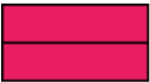

# Little Witch Academia

Again, Akko breaks a wall in little witch academia when she's practicing how to fly on broom! She doesn't want Diana to know about this, as Diana may be mad at her, so she turns to Ursula Sensei for help.

Ursula Sensei gives Akko two kinds of bricks:

* width $a$, height $1$
* width $b$, height $1$

Akko can use these two kinds of brick INFINITE times, and she CANNOT ROTATE the brick.

Now Akko must use these two kinds of bricks to fill the wall with width $w$ and height $h$. And in order to make the wall more stable, Akko hopes that between any two adjacent layers, there can be no BRICK GAP up and down except the left and right side.

A legal situation is like this:


And an illegal situation is like this:


as you can see ，there's a BRICK GAP in illegal situation:


Specially, you can fill the wall with only one kind of brick, which means the following situation is legal:



Now Akko wants to know there's how many different legal situations. Two situations are different if and only if in some layer, they have different brick order.

The Input consists of $t+1$ lines, the first line gives you the number of test cases $t(t\leq 10)$, then following $t$ lines gives $a \ b \ w \ h$, showing two different kinds of bricks and the size of the wall, and we guarantee:

$$
2\leq a,b \leq 10(a\neq b), \ 2\leq w\leq 20, \ 1\leq h\leq 10^9
$$

For each test case, you should output the number of legal situations in one line, your answer should mod $10^9+7$.

# Input

```
3
4 5 3 7
2 4 4 1
2 3 9 5
```

# Output

```
0
2
14
```